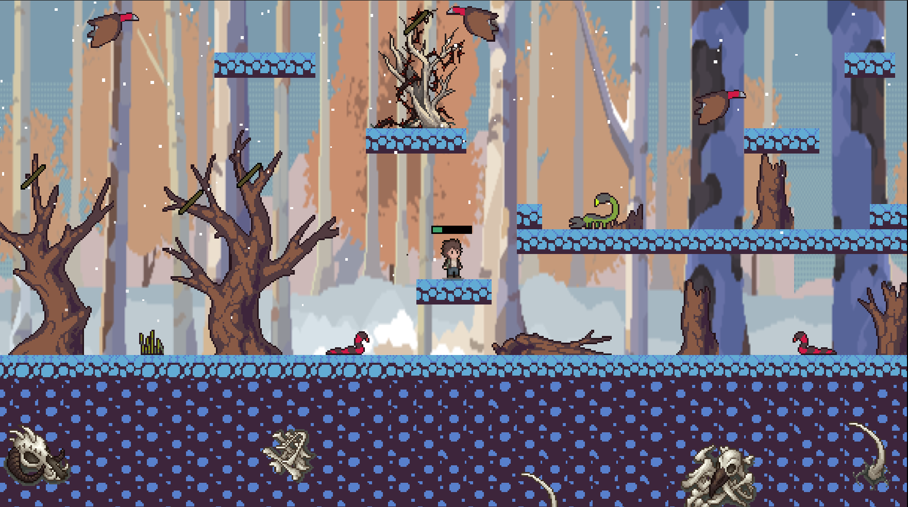

# Project GameJAM LABIRAS, Theme: Management

## ***Game :  [HOPE](https://kaio-gabriel-dev.itch.io/hope)***
The game **HOPE** was developed during a one-week game jam with the theme "management." Set in a post-apocalyptic world, the game follows the story of Edward, who, after the death of his parents, embarks on an adventure across the world in search of the City of Light.

> ## 🚀 CONCEPT
> * A 2D platform exploration game developed in Godot Engine, where the player must manage resources to survive the journey.

> ## 🔦 TECHNOLOGIES USED
> * **Godot engine:** The engine used for the game's development.
> * **GDScript:**  The programming language used in the engine.
> * **Git/GitHub:**  Used to store the code.
> * **Notion:** Used for project documentation.

> ## 🕹️ MECHANICS
>  * **Collectible Items:** Items that can be collected by the player.
>  * **Inventory:** The place where collected items are stored.
> * **Enemies:** Entities that cause damage to the player.
> * **Object Interaction:** Objects with which the player can interact.

> # 💻 [VIEW THE PROJECT](https://kaio-gabriel-dev.itch.io/hope)
> 

> # 🔗 CLONE THE PROJECT
> ``` bash
> git clone https://github.com/KaioGabriel-the/hope.git

# 📱 CONTACT
> * **Kaio Gabriel**
>> [](kkaiogabrielk@gmail.com)
>> [](https://www.linkedin.com/in/kaio-gabriel-de-sousa-carvalho-baa05b313/?utm_source=share&utm_campaign=share_via&utm_content=profile&utm_medium=android_app)
>> [](https://github.com/KaioGabriel-the)
> * **Thalysson Delano**
>> [](contato.thalyssondel@gmail.com)
>> [](https://www.linkedin.com/in/thalysson-delano-926459324/)
>> [](https://github.com/thalyssonDEV)
